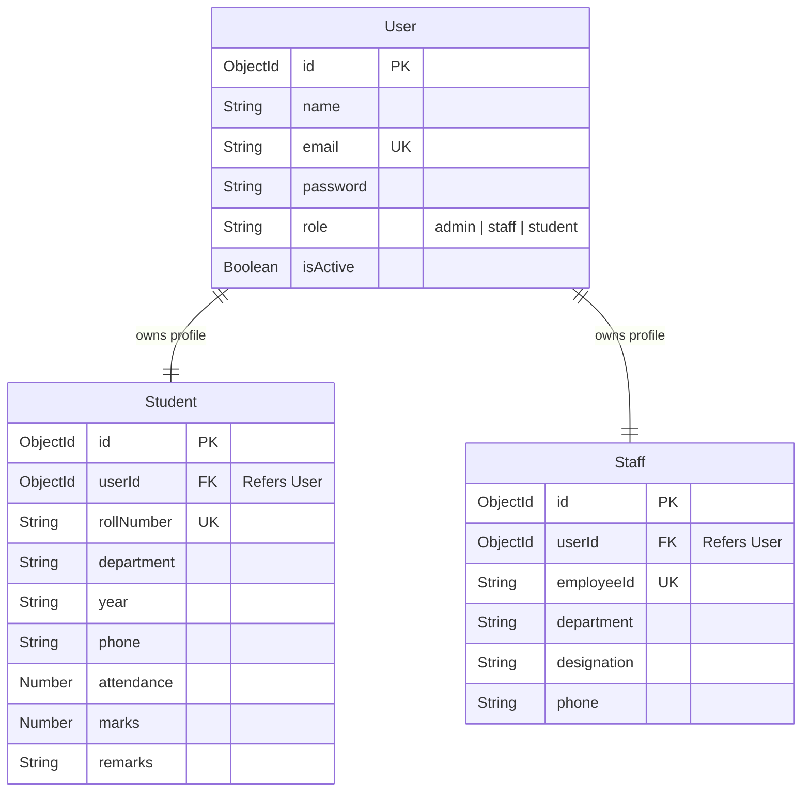

# Vertex College Management ERP System

A modern, responsive, and secure College ERP platform designed to manage student academic records, attendance logs, and faculty designations. Built with a decoupled **Client-Server architecture**, the system utilizes a Node.js/Express REST API on the backend and a Vite-powered React single page application (SPA) on the frontend.

---

## 🚀 Key Features

* **Role-Based Access Control (RBAC)**: Distinct spaces tailored for **Administrators**, **Teaching Staff**, and **Students**.
* **Student Registry & Management**: Complete admin controls for student registrations, credentials, and demographics.
* **Faculty Workspace**: Instructors can review classroom lists and update marks, attendance logs, and student metrics.
* **Interactive Student Portal**: Scholars track their marks progress, attendance standings (with circular visualizers), and advisory comments.
* **Database Rollback Integrity**: Robust registration handlers simulate transaction rollbacks to prevent orphaned accounts.
* **Security First**: Input sanitation, route guards, pre-save password hashing, and JWT bearer authentication.

---

## 🛠️ Technology Stack

### Backend
* **Core Runtime**: [Node.js](https://nodejs.org/) & [Express](https://expressjs.com/) (ES Modules)
* **Database & ODM**: [MongoDB](https://www.mongodb.com/) via [Mongoose](https://mongoosejs.com/)
* **Security & Tokens**: [JSON Web Tokens (JWT)](https://jwt.io/), [bcryptjs](https://github.com/dcodeIO/bcrypt.js)
* **Payload Validation**: [express-validator](https://express-validator.github.io/docs/)

### Frontend
* **Build tool**: [Vite](https://vitejs.dev/)
* **UI Library**: [React.js](https://react.dev/) (Hooks & Context API)
* **Icons**: [Lucide React](https://lucide.dev/)
* **Animations**: [Framer Motion](https://www.framer.com/motion/)
* **Routing**: [React Router DOM v6](https://reactrouter.com/)
* **HTTP client**: [Axios](https://axios-http.com/)

---

## 📁 Project Structure

The project is structured into two main directories:

```text
College-Management/
├── backend/                  # Express REST API Server
│   ├── config/               # Database connections
│   ├── controllers/          # Request handling logic
│   ├── middleware/           # Auth, Role guards, and Error handlers
│   ├── models/               # MongoDB Mongoose Schemas (User, Student, Staff)
│   ├── routes/               # API endpoints structure
│   ├── utils/                # Helper utilities and Database seeders
│   └── server.js             # Main server entrypoint
│
└── frontend/                 # React SPA Client
    ├── public/               # Static assets
    └── src/
        ├── api/              # Axios client with JWT interceptors
        ├── assets/           # UI images and media
        ├── components/       # Shared UI parts (Sidebar, Topbar, Table, Modal)
        ├── context/          # Global Authentication Context
        ├── pages/            # ERP dashboards and institutional informational pages
        ├── App.jsx           # Routing paths & Protected routes wrapper
        └── main.jsx          # React app entry point
```

---

## 🔄 System Architecture & Data Flows

### 1. Secure Authentication Flow

Users sign in via the unified login page. The authorization flow follows a structured process:

1. **Credentials verification**: The API compares passwords against hashed records using `bcrypt.compare()`.
2. **Session generation**: A token is created using a private key (`JWT_SECRET`) on the server.
3. **Client-side storage**: The React application saves the JWT inside `localStorage`.
4. **Automated requests**: The Axios interceptor (`frontend/src/api/axios.js`) automatically appends this token to headers as `Authorization: Bearer <token>`.

### 2. Authorization Guards

* **`authMiddleware.js`**: Reconstructs current user details from the decoded JWT.
* **`roleMiddleware.js`**: Evaluates active privileges to restrict endpoint calls:
  * **`admin`**: Full CRUD controls over students and staff.
  * **`staff`**: Metrics tracking (marks/attendance logs) for students.
  * **`student`**: Read-only operations for their personal profile and metrics.

### 3. Database Schema Relationships



---

## ⚙️ Setup & Installation

### Prerequisites
* [Node.js](https://nodejs.org/) (v16.x or higher)
* [MongoDB](https://www.mongodb.com/) (Local installation or MongoDB Atlas instance)

---

### Backend Setup

1. Navigate to the `backend` directory:
   ```bash
   cd backend
   ```

2. Install dependencies:
   ```bash
   npm install
   ```

3. Launch the server:
   - **Development Mode** (with hot reloading):
     ```bash
     npm run dev
     ```
   - **Production Mode**:
     ```bash
     npm start
     ```

---

### Frontend Setup

1. Navigate to the `frontend` directory:
   ```bash
   cd ../frontend
   ```

2. Install dependencies:
   ```bash
   npm install
   ```

3. Configure Backend Base URL:
   Open `src/api/axios.js` and configure the `baseURL` attribute to point to your local backend API (e.g., `http://localhost:5000/api`) or your deployed production server.

4. Run the Client:
   ```bash
   npm run dev
   ```

---

## 🔒 Security Practices

1. **Password Hashing**: Direct plain-text passwords are never stored. The Mongoose pre-save hook handles cryptography:
   ```javascript
   userSchema.pre('save', async function (next) {
     if (!this.isModified('password')) return next();
     const salt = await bcrypt.genSalt(10);
     this.password = await bcrypt.hash(this.password, salt);
     next();
   });
   ```
2. **Mongoose Sanitization**: Prevents database injection by filtering queries.
3. **Payload Verification**: Routes use strict parameter array specifications validation checks via `express-validator`.
4. **Environment Separation**: API configuration variables remain strictly decoupled from code surfaces.
